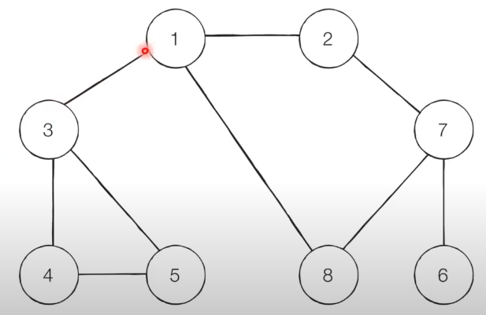

[치킨 배달](https://www.acmicpc.net/problem/15686)

1. 맵의 크기는 N x N, (r,c)의 형태 r과 c는 1부터 시작
2. 0은 빈칸, 1은 집, 2는 치킨집
3. 거리 구하는 방법 |r1-r2| + |c1-c2|
4. 집에서 거리가 최소인 치킨집까지의 거리 합
5. M개의 치킨집만 폐업하지 않는다

- sol1. 어느 곳을 기준으로? 집 / 집을 기준으로 방문한 위치에 있는 치킨집에 거리를 부여 -> 치킨집에 쌓인 수를 기준으로 정렬 -> 가장 작은 M개 많큼 더하기
    - 1회차 해결안된
    - 원인 : 재귀함수가 정상적으로 실행되지 않음 코드자체의 오류 
    - 해법?: 함수의 역할을 간결하게 정리할 필요가 있음

- sol2. 1번 예제에만 적용되는 풀이

# 입력
    - 맵의 크기 N, 폐업하지 않는 갯수 M
    - 맵 정보

# 출력
    - 최소 거리의 합

## DFS?
- 깊이 우선 탐색
- 스택 자료구조(혹은 재귀함수)를 이용
    1. 탐색 시작 노드를 스택에 넣고 방문처리
    2. 스택의 최상단 노드에 방문하지 않은 인접한 노드가 있으면 그 노드를 스택에 넣고 방문처리, 방문하지 않은 인접 노드가 없으면 최상단의 노드를 꺼낸다 -> 최상단 노드를 기준으로 동작
    3. 2번의 과정을 수행할 수 없을 때 까지 반복

- ex)
    [설명 영상](https://youtu.be/1vLqC1rItM8?t=63)
    1. 스택에 노드 1을 삽입
    2. 작은 순서(제시된 내용) 2를 스택에 삽입
    3. 2기준 인접한 방문하지 않은 가장 작은 노드 삽입(7)
    4. 7기준 인접한 방문하지 않은 가장 작은 노드 삽입(6)
    5. 6기준 인접 노드가 없으므로 스택에서 꺼내기
    ...
    순서: 1-> 2-> 7-> 6-> 8-> 3-> 4-> 5
