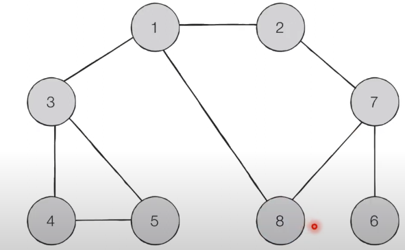

[로봇 청소기](https://www.acmicpc.net/problem/14503)

- 로봇 청소기가 있는 방의 크기 NxM (1칸의 크기는 1x1) 각 칸은 벽또는 빈칸, 청소기가 바라보는 방향(동서남북 중 하나) 칸의 좌표 (r,c), 좌상단 모서리 좌표 (0,0) 우하단 모서리(N-1,M-1), 빈칸은 청소되지 않은 상태
1. 현재 칸이 청소되지 않았다면, 현재칸을 청소한다
2. 현재 칸의 주변 4칸 중 펑소되지 않은 빈칸이 없을 경우  
    2.1. 한칸 후진 할 수 있다면 후진해서 그 칸을 청소한다  
    2.2. 바라보는 방향의 뒤쪽이 후진할 수 없다면 작동을 멈춘다
3. 현재 칸의 주변 4칸 중 청소되지 않은 빈 칸이 있는 경우  
    3.1. 반시계 방향으로 90도 회전
    3.2. 바라보는 방향을 기준으로 앞쪽 칸이 청소되지 않은 빈 칸인 경우 한칸 전진
    3.3. 1번으로 돌아간다

- sol1. 현재 칸을 큐에 적재, 같은 크기의 true/false 맵에 현재위치 true -> 바라보는 방향의 공간이 0인지 확인후 0일때 전진, 전진한 위치의 값을 true로 변환 -> 빈칸(0)이 모두 true일 때 주변에 양옆에 청소되지 않은 칸이 나올 때 까지 후진(바라보는 방향의 반대로 이동) -> 후진 할 수 없을 때 종료(값 반환)
    - 해결 x
    - 원인 : 청소된 것과 갈 수 있는 방향을 동시에 해결하려고 했음
    - 해법 : [ 갈 수 있는 방향을 우선적으로 확인 -> 갈 수 있는 방향에 도착 후 방문(청소)했는지 확인 ] 이 과정을 각 방향(북,서,남,동 순서)마다 수행 -> 4방향 모두 청소 할 수 업을 때 후진 이때 종료조건 제시[후진하는 곳에 벽이 있는 경우]
- sol2(재도전). 풀이 내부에 해결방법 작성 / 70% 수준 풀이 해냄

# 입력
    - 처음 2개 숫자 : N,M을 입력
    - 두번째 3개 숫자 : r,c 좌표, 방향(0:북,1:동,2:남,3:서)

# 출력
    - 청소한 칸의 갯수

## BFS?
- 너비우선탐색 : 시작노드부터 출발하여 그래프 내에서 가까운 노드부터 우선적으로 탐색하는 알고리즘
- que(큐) 자료구조를 이용
- 동작
    1. 탐색 시작 노드를 큐에 넣고 방문 처리를 한다
    2. 큐에서 노드를 꺼낸 뒤에 해당 노드의 인접 노드 중에서 방문하지 않은 노드를 모두 큐에 삽입하고 방문 처리한다
        - 인접한 노드를 한번에 넣는다
    3. 2번의 과정이 수행 할 수 없을 때 까지 반복
- 사용
    - 특정 조건에서의 최단 경로를 해결하기 위해
    - 큐 자료구조를 어떻게 사용하는 지 숙지

- ex)
    [설명 영상](https://youtu.be/CJiF-muKz30?t=129)
    1. 큐에 시작 노드 삽입 (1)
    2. 인접한 노드를 큐에 삽입 (2,3,8), 시작노드 제거 (~1)
    3. 노드 2의 인접 노드(7)를 큐에 삽입, 방문 노드 (~2) 제거
    4. 노드 3의 인접 노드(4,5)를 큐에 삽입, 방문 노드 (~3) 제거
    5. 노드 8의 인접 노드 확인, 방문 노드(~8) 제거

    -> 탐색 순서: 1-> 2-> 3-> 8-> 7-> 4-> 5-> 6
